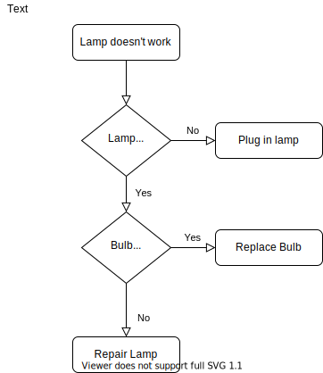

[](https://travis-ci.org/vielhuber/gtbabel)

# 🦜 Gtbabel 🦜

Gtbabel automatically translates your HTML/PHP pages – server sided!

## Basic idea

-   Gtbabel extracts on every page load any page into logical paragraph tokens.
-   Static and dynamic content is deliberately treated the same.
-   All tokens are replaced (if available) by it's translation before rendered.
-   The tokens get dumped (if not available), where they can be translated.

## Features

-   Lightweight: only ~3500 lines of code.
-   Embraces the power of [gettext](https://www.gnu.org/software/gettext/) (e.g. using extracted comments and template files).
-   Framework agnostic: works with nearly any PHP based cms or static site.
-   Fast: once all translations are available, Gtbabel reaches a throughput of ~4000 words/s.
-   Auto translation: use the power of [Google Translation API](https://cloud.google.com/translate/docs), [Microsoft Translation API](https://azure.microsoft.com/de-de/services/cognitive-services/translator-text-api/) or [DeepL](https://www.deepl.com) to auto translate your pages and links into any language.
-   Router included: spoof your request uri and let the magic happen, links are automatically converted (with slug collission detection).
-   Helper functions for current language and all languages available.
-   Basic seo considered: title tags, seo descriptions, html lang attribute, hreflang tags included.
-   RTL support: Adds a html dir attribute if language is rtl
-   WordPress plugin available.
-   Prepared for translation management.
-   Works seamlessly with caching/preloading plugins.
-   Besides plain html does also handle and translate xml (like in dynamically generated sitemaps) and json (like in ajax responses).
-   PHPUnit e2e tests available.
-   Multiple source languages supported concurrently.

## Requirements

-   PHP >=7.2

## Installation

Install once with [composer](https://getcomposer.org/):

```
composer require vielhuber/gtbabel
```

Then add this to your files:

```php
require __DIR__ . '/vendor/autoload.php';
use vielhuber\gtbabel\Gtbabel;
```

## Usage

```php
$gtbabel = new Gtbabel();

$gtbabel->start();

// any static or dynamic content
require_once 'template.html';

$gtbabel->stop();
```

## Configuration

If you don't provide an initial configuration, Gtbabel starts with reasonable default settings.\
You also can provide settings directly as an array or pass a path to a json file to overwrite (parts) of the default settings:

```php
$gtbabel->start(); // start with default settings
$gtbabel->start(['languages' => [['code' => 'de', 'label' => 'Deutsch'], ['code' => 'en', 'label' => 'English']], ...]); // overwrite settings in php
$gtbabel->start('settings.json'); // overwrite settings from json
```

The default configuration is:

```php
[
    'languages' => [
        [
            'code' => 'de',
            'label' => 'Deutsch',
            'rtl' => false,
            'google_translation_code' => 'de',
            'microsoft_translation_code' => 'de',
            'deepl_translation_code' => 'de'
        ],
        [
            'code' => 'en',
            'label' => 'English',
            'rtl' => false,
            'google_translation_code' => 'en',
            'microsoft_translation_code' => 'en',
            'deepl_translation_code' => 'en'
        ],
        [
            'code' => 'fr',
            'label' => 'Français',
            'rtl' => false,
            'google_translation_code' => 'fr',
            'microsoft_translation_code' => 'fr',
            'deepl_translation_code' => 'fr'
        ],
        [
            'code' => 'af',
            'label' => 'Afrikaans',
            'rtl' => false,
            'google_translation_code' => 'af',
            'microsoft_translation_code' => 'af',
            'deepl_translation_code' => null
        ],
        [
            'code' => 'am',
            'label' => 'አማርኛ',
            'rtl' => false,
            'google_translation_code' => 'am',
            'microsoft_translation_code' => null,
            'deepl_translation_code' => null
        ],
        [
            'code' => 'ar',
            'label' => 'العربية',
            'rtl' => true,
            'google_translation_code' => 'ar',
            'microsoft_translation_code' => 'ar',
            'deepl_translation_code' => null
        ],
        [
            'code' => 'az',
            'label' => 'Azərbaycan',
            'rtl' => false,
            'google_translation_code' => 'az',
            'microsoft_translation_code' => null,
            'deepl_translation_code' => null
        ],
        [
            'code' => 'be',
            'label' => 'беларускі',
            'rtl' => false,
            'google_translation_code' => 'be',
            'microsoft_translation_code' => null,
            'deepl_translation_code' => null
        ],
        [
            'code' => 'bg',
            'label' => 'български',
            'rtl' => false,
            'google_translation_code' => 'bg',
            'microsoft_translation_code' => 'bg',
            'deepl_translation_code' => null
        ],
        [
            'code' => 'bn',
            'label' => 'বাঙালির',
            'rtl' => false,
            'google_translation_code' => 'bn',
            'microsoft_translation_code' => 'bn',
            'deepl_translation_code' => null
        ],
        [
            'code' => 'bs',
            'label' => 'Bosanski',
            'rtl' => false,
            'google_translation_code' => 'bs',
            'microsoft_translation_code' => 'bs',
            'deepl_translation_code' => null
        ],
        [
            'code' => 'ca',
            'label' => 'Català',
            'rtl' => false,
            'google_translation_code' => 'ca',
            'microsoft_translation_code' => 'ca',
            'deepl_translation_code' => null
        ],
        [
            'code' => 'ceb',
            'label' => 'Cebuano',
            'rtl' => false,
            'google_translation_code' => 'ceb',
            'microsoft_translation_code' => null,
            'deepl_translation_code' => null
        ],
        [
            'code' => 'co',
            'label' => 'Corsican',
            'rtl' => false,
            'google_translation_code' => 'co',
            'microsoft_translation_code' => null,
            'deepl_translation_code' => null
        ],
        [
            'code' => 'cs',
            'label' => 'Český',
            'rtl' => false,
            'google_translation_code' => 'cs',
            'microsoft_translation_code' => 'cs',
            'deepl_translation_code' => null
        ],
        [
            'code' => 'cy',
            'label' => 'Cymraeg',
            'rtl' => false,
            'google_translation_code' => 'cy',
            'microsoft_translation_code' => 'cy',
            'deepl_translation_code' => null
        ],
        [
            'code' => 'da',
            'label' => 'Dansk',
            'rtl' => false,
            'google_translation_code' => 'da',
            'microsoft_translation_code' => 'da',
            'deepl_translation_code' => null
        ],
        [
            'code' => 'el',
            'label' => 'ελληνικά',
            'rtl' => false,
            'google_translation_code' => 'el',
            'microsoft_translation_code' => 'el',
            'deepl_translation_code' => null
        ],
        [
            'code' => 'eo',
            'label' => 'Esperanto',
            'rtl' => false,
            'google_translation_code' => 'eo',
            'microsoft_translation_code' => null,
            'deepl_translation_code' => null
        ],
        [
            'code' => 'es',
            'label' => 'Español',
            'rtl' => false,
            'google_translation_code' => 'es',
            'microsoft_translation_code' => 'es',
            'deepl_translation_code' => 'es'
        ],
        [
            'code' => 'et',
            'label' => 'Eesti',
            'rtl' => false,
            'google_translation_code' => 'et',
            'microsoft_translation_code' => 'et',
            'deepl_translation_code' => null
        ],
        [
            'code' => 'eu',
            'label' => 'Euskal',
            'rtl' => false,
            'google_translation_code' => 'eu',
            'microsoft_translation_code' => null,
            'deepl_translation_code' => null
        ],
        [
            'code' => 'fa',
            'label' => 'فارسی',
            'rtl' => true,
            'google_translation_code' => 'fa',
            'microsoft_translation_code' => 'fa',
            'deepl_translation_code' => null
        ],
        [
            'code' => 'fi',
            'label' => 'Suomalainen',
            'rtl' => false,
            'google_translation_code' => 'fi',
            'microsoft_translation_code' => 'fi',
            'deepl_translation_code' => null
        ],
        [
            'code' => 'ga',
            'label' => 'Gaeilge',
            'rtl' => false,
            'google_translation_code' => 'ga',
            'microsoft_translation_code' => 'ga',
            'deepl_translation_code' => null
        ],
        [
            'code' => 'gd',
            'label' => 'Gàidhlig',
            'rtl' => false,
            'google_translation_code' => 'gd',
            'microsoft_translation_code' => null,
            'deepl_translation_code' => null
        ],
        [
            'code' => 'gl',
            'label' => 'Galego',
            'rtl' => false,
            'google_translation_code' => 'gl',
            'microsoft_translation_code' => null,
            'deepl_translation_code' => null
        ],
        [
            'code' => 'gu',
            'label' => 'ગુજરાતી',
            'rtl' => false,
            'google_translation_code' => 'gu',
            'microsoft_translation_code' => 'gu',
            'deepl_translation_code' => null
        ],
        [
            'code' => 'ha',
            'label' => 'Hausa',
            'rtl' => true,
            'google_translation_code' => 'ha',
            'microsoft_translation_code' => null,
            'deepl_translation_code' => null
        ],
        [
            'code' => 'haw',
            'label' => 'Hawaiian',
            'rtl' => false,
            'google_translation_code' => 'haw',
            'microsoft_translation_code' => null,
            'deepl_translation_code' => null
        ],
        [
            'code' => 'he',
            'label' => 'עברי',
            'rtl' => true,
            'google_translation_code' => 'he',
            'microsoft_translation_code' => 'he',
            'deepl_translation_code' => null
        ],
        [
            'code' => 'hi',
            'label' => 'हिन्दी',
            'rtl' => false,
            'google_translation_code' => 'hi',
            'microsoft_translation_code' => 'hi',
            'deepl_translation_code' => null
        ],
        [
            'code' => 'hmn',
            'label' => 'Hmong',
            'rtl' => false,
            'google_translation_code' => 'hmn',
            'microsoft_translation_code' => 'mww',
            'deepl_translation_code' => null
        ],
        [
            'code' => 'hr',
            'label' => 'Hrvatski',
            'rtl' => false,
            'google_translation_code' => 'hr',
            'microsoft_translation_code' => 'hr',
            'deepl_translation_code' => null
        ],
        [
            'code' => 'ht',
            'label' => 'Kreyòl',
            'rtl' => false,
            'google_translation_code' => 'ht',
            'microsoft_translation_code' => 'ht',
            'deepl_translation_code' => null
        ],
        [
            'code' => 'hu',
            'label' => 'Magyar',
            'rtl' => false,
            'google_translation_code' => 'hu',
            'microsoft_translation_code' => 'hu',
            'deepl_translation_code' => null
        ],
        [
            'code' => 'hy',
            'label' => 'հայերեն',
            'rtl' => false,
            'google_translation_code' => 'hy',
            'microsoft_translation_code' => null,
            'deepl_translation_code' => null
        ],
        [
            'code' => 'id',
            'label' => 'Indonesia',
            'rtl' => false,
            'google_translation_code' => 'id',
            'microsoft_translation_code' => 'id',
            'deepl_translation_code' => null
        ],
        [
            'code' => 'ig',
            'label' => 'Igbo',
            'rtl' => false,
            'google_translation_code' => 'ig',
            'microsoft_translation_code' => null,
            'deepl_translation_code' => null
        ],
        [
            'code' => 'is',
            'label' => 'Icelandic',
            'rtl' => false,
            'google_translation_code' => 'is',
            'microsoft_translation_code' => 'is',
            'deepl_translation_code' => null
        ],
        [
            'code' => 'it',
            'label' => 'Italiano',
            'rtl' => false,
            'google_translation_code' => 'it',
            'microsoft_translation_code' => 'it',
            'deepl_translation_code' => 'it'
        ],
        [
            'code' => 'ja',
            'label' => '日本の',
            'rtl' => false,
            'google_translation_code' => 'ja',
            'microsoft_translation_code' => 'ja',
            'deepl_translation_code' => 'ja'
        ],
        [
            'code' => 'jv',
            'label' => 'Jawa',
            'rtl' => false,
            'google_translation_code' => 'jv',
            'microsoft_translation_code' => null,
            'deepl_translation_code' => null
        ],
        [
            'code' => 'ka',
            'label' => 'ქართული',
            'rtl' => false,
            'google_translation_code' => 'ka',
            'microsoft_translation_code' => null,
            'deepl_translation_code' => null
        ],
        [
            'code' => 'kk',
            'label' => 'Қазақ',
            'rtl' => false,
            'google_translation_code' => 'kk',
            'microsoft_translation_code' => 'kk',
            'deepl_translation_code' => null
        ],
        [
            'code' => 'km',
            'label' => 'ខ្មែរ',
            'rtl' => false,
            'google_translation_code' => 'km',
            'microsoft_translation_code' => null,
            'deepl_translation_code' => null
        ],
        [
            'code' => 'kn',
            'label' => 'ಕನ್ನಡ',
            'rtl' => false,
            'google_translation_code' => 'kn',
            'microsoft_translation_code' => 'kn',
            'deepl_translation_code' => null
        ],
        [
            'code' => 'ko',
            'label' => '한국의',
            'rtl' => false,
            'google_translation_code' => 'ko',
            'microsoft_translation_code' => 'ko',
            'deepl_translation_code' => null
        ],
        [
            'code' => 'ku',
            'label' => 'Kurdî',
            'rtl' => true,
            'google_translation_code' => 'ku',
            'microsoft_translation_code' => null,
            'deepl_translation_code' => null
        ],
        [
            'code' => 'ky',
            'label' => 'Кыргыз',
            'rtl' => false,
            'google_translation_code' => 'ky',
            'microsoft_translation_code' => null,
            'deepl_translation_code' => null
        ],
        [
            'code' => 'la',
            'label' => 'Latine',
            'rtl' => false,
            'google_translation_code' => 'la',
            'microsoft_translation_code' => null,
            'deepl_translation_code' => null
        ],
        [
            'code' => 'lb',
            'label' => 'Lëtzebuergesch',
            'rtl' => false,
            'google_translation_code' => 'lb',
            'microsoft_translation_code' => null,
            'deepl_translation_code' => null
        ],
        [
            'code' => 'lo',
            'label' => 'ລາວ',
            'rtl' => false,
            'google_translation_code' => 'lo',
            'microsoft_translation_code' => null,
            'deepl_translation_code' => null
        ],
        [
            'code' => 'lt',
            'label' => 'Lietuvos',
            'rtl' => false,
            'google_translation_code' => 'lt',
            'microsoft_translation_code' => 'lt',
            'deepl_translation_code' => null
        ],
        [
            'code' => 'lv',
            'label' => 'Latvijas',
            'rtl' => false,
            'google_translation_code' => 'lv',
            'microsoft_translation_code' => 'lv',
            'deepl_translation_code' => null
        ],
        [
            'code' => 'mg',
            'label' => 'Malagasy',
            'rtl' => false,
            'google_translation_code' => 'mg',
            'microsoft_translation_code' => 'mg',
            'deepl_translation_code' => null
        ],
        [
            'code' => 'mi',
            'label' => 'Maori',
            'rtl' => false,
            'google_translation_code' => 'mi',
            'microsoft_translation_code' => 'mi',
            'deepl_translation_code' => null
        ],
        [
            'code' => 'mk',
            'label' => 'македонски',
            'rtl' => false,
            'google_translation_code' => 'mk',
            'microsoft_translation_code' => null,
            'deepl_translation_code' => null
        ],
        [
            'code' => 'ml',
            'label' => 'മലയാളം',
            'rtl' => false,
            'google_translation_code' => 'ml',
            'microsoft_translation_code' => 'ml',
            'deepl_translation_code' => null
        ],
        [
            'code' => 'mn',
            'label' => 'Монгол',
            'rtl' => false,
            'google_translation_code' => 'mn',
            'microsoft_translation_code' => null,
            'deepl_translation_code' => null
        ],
        [
            'code' => 'mr',
            'label' => 'मराठी',
            'rtl' => false,
            'google_translation_code' => 'mr',
            'microsoft_translation_code' => 'mr',
            'deepl_translation_code' => null
        ],
        [
            'code' => 'ms',
            'label' => 'Malay',
            'rtl' => false,
            'google_translation_code' => 'ms',
            'microsoft_translation_code' => 'ms',
            'deepl_translation_code' => null
        ],
        [
            'code' => 'mt',
            'label' => 'Malti',
            'rtl' => false,
            'google_translation_code' => 'mt',
            'microsoft_translation_code' => 'mt',
            'deepl_translation_code' => null
        ],
        [
            'code' => 'my',
            'label' => 'မြန်မာ',
            'rtl' => false,
            'google_translation_code' => 'my',
            'microsoft_translation_code' => null,
            'deepl_translation_code' => null
        ],
        [
            'code' => 'ne',
            'label' => 'नेपाली',
            'rtl' => false,
            'google_translation_code' => 'ne',
            'microsoft_translation_code' => null,
            'deepl_translation_code' => null
        ],
        [
            'code' => 'nl',
            'label' => 'Nederlands',
            'rtl' => false,
            'google_translation_code' => 'nl',
            'microsoft_translation_code' => 'nl',
            'deepl_translation_code' => 'nl'
        ],
        [
            'code' => 'no',
            'label' => 'Norsk',
            'rtl' => false,
            'google_translation_code' => 'no',
            'microsoft_translation_code' => 'nb',
            'deepl_translation_code' => null
        ],
        [
            'code' => 'ny',
            'label' => 'Nyanja',
            'rtl' => false,
            'google_translation_code' => 'ny',
            'microsoft_translation_code' => null,
            'deepl_translation_code' => null
        ],
        [
            'code' => 'pa',
            'label' => 'ਪੰਜਾਬੀ',
            'rtl' => false,
            'google_translation_code' => 'pa',
            'microsoft_translation_code' => 'pa',
            'deepl_translation_code' => null
        ],
        [
            'code' => 'pl',
            'label' => 'Polski',
            'rtl' => false,
            'google_translation_code' => 'pl',
            'microsoft_translation_code' => 'pl',
            'deepl_translation_code' => 'pl'
        ],
        [
            'code' => 'ps',
            'label' => 'پښتو',
            'rtl' => true,
            'google_translation_code' => 'ps',
            'microsoft_translation_code' => null,
            'deepl_translation_code' => null
        ],
        [
            'code' => 'pt-br',
            'label' => 'Português (Brasil)',
            'rtl' => false,
            'google_translation_code' => 'pt',
            'microsoft_translation_code' => 'pt-br',
            'deepl_translation_code' => 'pt'
        ],
        [
            'code' => 'pt-pt',
            'label' => 'Português (Portugal)',
            'rtl' => false,
            'google_translation_code' => 'pt',
            'microsoft_translation_code' => 'pt-pt',
            'deepl_translation_code' => 'pt'
        ],
        [
            'code' => 'ro',
            'label' => 'Românesc',
            'rtl' => false,
            'google_translation_code' => 'ro',
            'microsoft_translation_code' => 'ro',
            'deepl_translation_code' => null
        ],
        [
            'code' => 'ru',
            'label' => 'Русский',
            'rtl' => false,
            'google_translation_code' => 'ru',
            'microsoft_translation_code' => 'ru',
            'deepl_translation_code' => 'ru'
        ],
        [
            'code' => 'sd',
            'label' => 'سنڌي',
            'rtl' => false,
            'google_translation_code' => 'sd',
            'microsoft_translation_code' => null,
            'deepl_translation_code' => null
        ],
        [
            'code' => 'si',
            'label' => 'සිංහලයන්',
            'rtl' => false,
            'google_translation_code' => 'si',
            'microsoft_translation_code' => null,
            'deepl_translation_code' => null
        ],
        [
            'code' => 'sk',
            'label' => 'Slovenský',
            'rtl' => false,
            'google_translation_code' => 'sk',
            'microsoft_translation_code' => 'sk',
            'deepl_translation_code' => null
        ],
        [
            'code' => 'sl',
            'label' => 'Slovenski',
            'rtl' => false,
            'google_translation_code' => 'sl',
            'microsoft_translation_code' => 'sl',
            'deepl_translation_code' => null
        ],
        [
            'code' => 'sm',
            'label' => 'Samoa',
            'rtl' => false,
            'google_translation_code' => 'sm',
            'microsoft_translation_code' => 'sm',
            'deepl_translation_code' => null
        ],
        [
            'code' => 'sn',
            'label' => 'Shona',
            'rtl' => false,
            'google_translation_code' => 'sn',
            'microsoft_translation_code' => null,
            'deepl_translation_code' => null
        ],
        [
            'code' => 'so',
            'label' => 'Soomaali',
            'rtl' => false,
            'google_translation_code' => 'so',
            'microsoft_translation_code' => null,
            'deepl_translation_code' => null
        ],
        [
            'code' => 'sq',
            'label' => 'Shqiptar',
            'rtl' => false,
            'google_translation_code' => 'sq',
            'microsoft_translation_code' => null,
            'deepl_translation_code' => null
        ],
        [
            'code' => 'sr-cy',
            'label' => 'Српски (ћирилица)',
            'rtl' => false,
            'google_translation_code' => 'sr',
            'microsoft_translation_code' => 'sr-Cyrl',
            'deepl_translation_code' => null
        ],
        [
            'code' => 'sr-la',
            'label' => 'Српски (латински)',
            'rtl' => false,
            'google_translation_code' => 'sr',
            'microsoft_translation_code' => 'sr-Latn',
            'deepl_translation_code' => null
        ],
        [
            'code' => 'su',
            'label' => 'Sunda',
            'rtl' => false,
            'google_translation_code' => 'su',
            'microsoft_translation_code' => null,
            'deepl_translation_code' => null
        ],
        [
            'code' => 'sv',
            'label' => 'Svenska',
            'rtl' => false,
            'google_translation_code' => 'sv',
            'microsoft_translation_code' => 'sv',
            'deepl_translation_code' => null
        ],
        [
            'code' => 'ta',
            'label' => 'தமிழ்',
            'rtl' => false,
            'google_translation_code' => 'ta',
            'microsoft_translation_code' => 'ta',
            'deepl_translation_code' => null
        ],
        [
            'code' => 'te',
            'label' => 'Telugu',
            'rtl' => false,
            'google_translation_code' => 'te',
            'microsoft_translation_code' => 'te',
            'deepl_translation_code' => null
        ],
        [
            'code' => 'tg',
            'label' => 'Тоҷикистон',
            'rtl' => false,
            'google_translation_code' => 'tg',
            'microsoft_translation_code' => null,
            'deepl_translation_code' => null
        ],
        [
            'code' => 'th',
            'label' => 'ไทย',
            'rtl' => false,
            'google_translation_code' => 'th',
            'microsoft_translation_code' => 'th',
            'deepl_translation_code' => null
        ],
        [
            'code' => 'tr',
            'label' => 'Türk',
            'rtl' => false,
            'google_translation_code' => 'tr',
            'microsoft_translation_code' => 'tr',
            'deepl_translation_code' => null
        ],
        [
            'code' => 'uk',
            'label' => 'Український',
            'rtl' => false,
            'google_translation_code' => 'uk',
            'microsoft_translation_code' => 'uk',
            'deepl_translation_code' => null
        ],
        [
            'code' => 'ur',
            'label' => 'اردو',
            'rtl' => true,
            'google_translation_code' => 'ur',
            'microsoft_translation_code' => 'ur',
            'deepl_translation_code' => null
        ],
        [
            'code' => 'uz',
            'label' => 'O\'zbekiston',
            'rtl' => false,
            'google_translation_code' => 'uz',
            'microsoft_translation_code' => null,
            'deepl_translation_code' => null
        ],
        [
            'code' => 'vi',
            'label' => 'Tiếng việt',
            'rtl' => false,
            'google_translation_code' => 'vi',
            'microsoft_translation_code' => 'vi',
            'deepl_translation_code' => null
        ],
        [
            'code' => 'xh',
            'label' => 'IsiXhosa',
            'rtl' => false,
            'google_translation_code' => 'xh',
            'microsoft_translation_code' => null,
            'deepl_translation_code' => null
        ],
        [
            'code' => 'yi',
            'label' => 'ייִדיש',
            'rtl' => true,
            'google_translation_code' => 'yi',
            'microsoft_translation_code' => null,
            'deepl_translation_code' => null
        ],
        [
            'code' => 'yo',
            'label' => 'Yoruba',
            'rtl' => false,
            'google_translation_code' => 'yo',
            'microsoft_translation_code' => null,
            'deepl_translation_code' => null
        ],
        [
            'code' => 'zh-cn',
            'label' => '中文（简体）',
            'rtl' => false,
            'google_translation_code' => 'zh-cn',
            'microsoft_translation_code' => 'zh-Hans',
            'deepl_translation_code' => 'zh'
        ],
        [
            'code' => 'zh-tw',
            'label' => '中文（繁體）',
            'rtl' => false,
            'google_translation_code' => 'zh-tw',
            'microsoft_translation_code' => 'zh-Hant',
            'deepl_translation_code' => 'zh'
        ],
        [
            'code' => 'zu',
            'label' => 'Zulu',
            'rtl' => false,
            'google_translation_code' => 'zu',
            'microsoft_translation_code' => null,
            'deepl_translation_code' => null
        ]
    ],
    'lng_source' => 'de',
    'lng_target' => null, // this gets automatically determined by the current url
    'database' => [
        'type' => 'sqlite',
        'filename' => 'data.db',
        'table' => 'translations'
        // mysql/pgsql is also supported
        /*
        'type' => 'mysql',
        'host' => '127.0.0.1',
        'username' => 'xxxxxx',
        'password' => 'xxxxxx',
        'database' => 'xxxxxx',
        'port' => 3306,
        'table' => 'translations'
        */
    ],
    'log_folder' => '/logs',
    'prefix_source_lng' => true,
    'redirect_root_domain' => 'browser', // 'browser'|'source' (only relevant if prefix_source_lng=true)
    'translate_default_tag_nodes' => true,
    'html_lang_attribute' => true,
    'html_hreflang_tags' => true,
    'debug_translations' => false, // surround outputted translations with "%|%" to see borders
    'auto_add_translations' => true,
    'auto_set_new_strings_checked' => false,
    'auto_set_discovered_strings_checked' => false,
    'only_show_checked_strings' => true,
    'auto_translation' => true,
    'auto_translation_service' => 'google', // google|microsoft|deepl
    'google_translation_api_key' => [], // use a string or array of strings to provide multiple keys at once
    'microsoft_translation_api_key' => [], // use a string or array of strings to provide multiple keys at once
    'deepl_translation_api_key' => [], // use a string or array of strings to provide multiple keys at once
    'stats_log' => true,
    'discovery_log' => false,
    'prevent_publish' => true,
    'prevent_publish_urls' => [
        '/path/in/source/lng/to/specific/page' => ['en', 'fr'],
        '/slug1/*' => ['en'], // you can also use wildcards here
        '/slug1/*/slug2' => ['fr']
        //'/*' => ['en', 'fr'] // disable whole languages
    ],
    'exclude_urls' => ['/backend'],
    'exclude_dom' => ['.notranslate', '.lngpicker'],
    'force_tokenize' => ['.force-tokenize'],
    'include_dom' => [
        [
            'selector' => '.search-submit', // css or xpath selectors supported
            'attribute' => 'value'
        ],
        [
            'selector' => '.js-link',
            'attribute' => 'alt-href',
            'context' => 'slug'
        ]
    ]
];
```

## Other usage

Gtbabel catches the content between `start()` and `stop()` with [output buffering](https://www.php.net/manual/de/function.ob-start.php).\
However, you can also use Gtbabel more directly:

```php
$gtbabel = new Gtbabel();

$gtbabel->translate('<p>Dies ist ein Test!</p>', [
    'lng_source' => 'de',
    'lng_target' => 'en',
    'google_translation_api_key' => '...'
]); // <p>This is a test!</p>

$gtbabel->tokenize('<p>Dies ist ein Test!</p>'); // [['string' => 'This is a test!', 'context' => null]]
```

## WordPress plugin

[wordpress.org/plugins/gtbabel](https://wordpress.org/plugins/gtbabel/)

You don't have to change any code in the frontend at all: If you already have functions like `__()` in your code, just leave them (since WordPress internally only knows about the source language); if not, don't add them. Gtbabel acts on the output (like on any other page).

The following features are included:

-   Configuration gui
-   Easy setup wizard
-   Auto translation (including sitemap parser)
-   Delete unused strings
-   Detect shared strings
-   Manual string translation (search and filter by url)
-   Translation services
-   Support for plugins like [Contact Form 7](https://de.wordpress.org/plugins/contact-form-7/)
-   Translate specific posts/pages or any other url
-   Control publish status of posts/pages (slug changes are auto-reflected in the `prevent_publish_urls`-option)
-   Possibility to replace files per language via the media library

## Database and Gettext

-   The final html gets parsed and is split up in reasonable strings.
-   Gtbabel operates on a database layer (e.g. sqlite) to ensure fast load times.
-   The database structure reflects the structure of [GNU gettext](https://www.gnu.org/software/gettext/).
-   You can export and import the data at any time.

## JavaScript

Gtbabel itself is based on PHP and only works for static pages or pages rendered via PHP.\
The whole idea can be relatively easy implemented in js frameworks like Vue or React.\
To get translations in JavaScript from your PHP application, Gtbabel provides a neat helper function to hotload your translations in the header that works in every environment. Execute the following function before you include your js files:

```php
gtbabel_localize_js(['string', ['string', 'context']]);
```

Now you can access those strings easily inside JavaScript with:

```js
gtbabel__('string');
gtbabel__('string', 'context');
```

Also first check, if Gtbabel is available in JavaScript with `if (typeof gtbabel__ === 'function') { }`.

In WordPress environments Gtbabel gives you a backend interface to handle the strings more conveniently.\
Instead you can also can use [wp_localize_script](https://codex.wordpress.org/Function_Reference/wp_localize_script) (in conjunction with `gtbabel__`).

## Modified nodes

By default Gtbabel translates all text and tag nodes with the following rules:

| selector                        | text | attribute        | context          |
| ------------------------------- | ---- | ---------------- | ---------------- |
| `body *`                        | ✓    | ✗                | `auto`           |
| `body a`                        | ✗    | `href^="mailto"` | `email`          |
| `body a`                        | ✗    | `href`           | `'slug'\|'file'` |
| `body form`                     | ✗    | `action`         | `'slug'`         |
| `body img`                      | ✗    | `alt`            | `auto`           |
| `body *`                        | ✗    | `title`          | `auto`           |
| `body input`                    | ✗    | `placeholder`    | `auto`           |
| `head title`                    | ✓    | ✗                | `'title'`        |
| `head meta[name="description"]` | ✗    | `content`        | `'description'`  |
| `body img`                      | ✗    | `src`            | `'file'`         |
| `body *`                        | ✗    | `style`          | `'file'`         |
| `body *`                        | ✗    | `data-*`         | `auto`           |
| `body *`                        | ✗    | `label`          | `auto`           |
| `body *`                        | ✗    | `*text*`         | `auto`           |

To disable text/tag node transformation, provide the option:

-   `'translate_default_tag_nodes' => false`

You can add your own tag node transformations via the `include_dom` option.

Be aware that the rules are processed sequentially and attribute names are never transformed twice.

Gtbabel automatically groups together reasonable parts.\
The following code gets converted to 1 token (not 3):

`<p>This is a <a href="#">link</a> inside a text.</p>`

If you want to influence that behaviour, use the `force_tokenize` option and provide the selector of the parent element in order to not tokenize its children.

If you want to influence that special tags should not be auto translated by the Google/Microsoft/DeepL Translation API, use a special class:

`<p>Das ist das <span class="notranslate">Haus</span> vom Nikolaus</p>`

The part before and after the `span`-tag gets translated (and added to gettext).\
If you want to exclude a complete node of being translated (and not added to gettext), add a class with the value `notranslate` (or any other value defined in `exclude_dom`) to the parent node:

`<p class="notranslate">Das ist das <span>Haus</span> vom Nikolaus</p>`

Note that attributes of ignored nodes are also not translated (the `href`-attribute and the text `Link` does not get translated):

`<a href="/home" class="notranslate">Link</a>`

However, if you want the `href`-attribute to be modified, do something like

`<a href="/home"><span class="notranslate">Link</span></a>`

## HTML in gettext

Gtbabel preserves inline HTML-tags and leaves them inside your gettext strings.\
However, attributes are automatically stripped. So

`<a href="https://tld.com" class="foo" data-bar="baz">Hallo</a> Welt!`

gets converted to

`<a>Hallo</a> Welt!`

and that string is e.g. stored in a translation as

`<a>Hello</a> world!`

so that your translators are not confused with unnecessary clutter.\
The translated version has of course the attributes back again:

`<a href="https://tld.com" class="foo" data-bar="baz">Hello</a> world!`

However, if ordering is crucial, Gtbabel provides a mechanism to determine order (and duplication).\
So for example

`Das deutsche <a href="https://1.com">Brot</a> <a href="https://2.com">vermisse</a> ich am meisten.`

is stored in your gettext files as

`Das deutsche <a>Brot</a> <a>vermisse</a> ich am meisten.`

If your translations don't reflect the original order, in gettext they include hints like

`I <a p="2">miss</a> German <a p="1">bread</a> the most.`

where "2" stands for the second tag of the original string.

The string then finally gets correctly translated to

`I <a href="https://2.com">miss</a> German <a href="https://1.com">bread</a> the most.`

## Ambiguous translations and plural forms

Consider the following example:

```html
<ul>
    <li>Bank</li>
    <!-- bank -->
    <li>Bank</li>
    <!-- bench -->
    <li>Schlüssel</li>
    <!-- key (singular) -->
    <li>Schlüssel</li>
    <!-- keys (plural) -->
</ul>
```

Normally Gtbabel would create 2 translations from this and cannot distinguish between ambiguous translations and singular/plural forms.

In order to get that use the special `data-context`-attribute to force sensible contexts:

```html
<ul>
    <li data-context="finance">Bank</li>
    <!-- bank -->
    <li data-context="furniture">Bank</li>
    <!-- bench -->
    <li data-context="singular">Schlüssel</li>
    <!-- key (singular) -->
    <li data-context="plural">Schlüssel</li>
    <!-- keys (plural) -->
</ul>
```

This way you can provide different translations.

## Multiple source languages

Gtbabel is not restricted to use one single source language for the whole content.\
In fact, parts of the content can be marked language-specific:

```html
<!DOCTYPE html>
<html lang="en">
    <body>
        <p>
            Some content in english.
        </p>
        <div lang="fr">
            Contenu en français.
        </div>
        <p>
            Some other content in english.
        </p>
    </body>
</html>
```

This all gets translated correctly to the target language (in our case `de`):

```html
<!DOCTYPE html>
<html lang="de">
    <body>
        <p>
            Einige Inhalte in Englisch.
        </p>
        <div lang="de">
            Inhalt auf Französisch.
        </div>
        <p>
            Einige andere Inhalte in Englisch.
        </p>
    </body>
</html>
```

## Router

The router automatically modifies the `$_SERVER['REQUEST_URI']` variable to catch translated urls.\
Unknown translations of urls are picked up from the current url and from links that are on the page.\
These urls are automatically added to gettext (ajax requested urls are excluded).

## Dealing with assets

Although Gtbabel leaves static files untouched, it adds them to the template file (with context `file`). This gives you the possibility to output images, downloads and other media individually per language.

## JSON Responses

JSON responses are also automatically parsed by Gtbabel.\
Currently only string values are automatically translated.

## Translation management

If `only_show_checked_strings` is set to `true`, only translations with an [extracted comment](https://www.gnu.org/software/gettext/manual/html_node/PO-Files.html) of `#. checked` are shown. This way you can build an approval system in your backend, where translators can check strings before they are published.

## Flow diagram



## Helper functions

Always surround these helper functions with `if( function_exists('...') ) { }`.

```php
gtbabel_current_lng() // 'en'
gtbabel_languages() // ['de','en']
gtbabel_default_language_codes() // ['de','en','fr','af','am','ar','az','be','bg','bn','bs','ca','ceb','co','cs','cy','da','el','eo','es','et','eu','fa','fi','ga','gd','gl','gu','ha','haw','he','hi','hmn','hr','ht','hu','hy','id','ig','is','it','ja','jv','ka','kk','km','kn','ko','ku','ky','la','lb','lo','lt','lv','mg','mi','mk','ml','mn','mr','ms','mt','my','ne','nl','no','ny','pa','pl','ps','pt','ro','ru','sd','si','sk','sl','sm','sn','so','sq','sr','su','sv','ta','te','tg','th','tr','uk','ur','uz','vi','xh','yi','yo','zh-cn','zh-tw','zu']
gtbabel_default_languages() // [['code' => 'de', 'label' => 'Deutsch'], ['code' => 'en', 'label' => 'English'], ...]
gtbabel_language_label('en') // 'English'
gtbabel_default_settings() // ['languages' => [['code' => 'de', 'label' => 'Deutsch'], ['code' => 'en', 'label' => 'English'], ...], 'log_folder' => '/logs', ...]
gtbabel_default_settings(['log_folder' => '/foo']) // ['languages' => [['code' => 'de', 'label' => 'Deutsch'], ['code' => 'en', 'label' => 'English'], ...], 'log_folder' => '/foo', ...]

gtbabel_languagepicker() // [['code' => 'de', 'label' => 'Deutsch', 'url' => 'https://tld.com/de/nudel', 'active' => true], ['code' => 'en', 'label' => 'English', 'url' => 'https://tld.com/en/noodle', 'active' => false], ...]

gtbabel_localize_js(['string', ['string', 'context']]) // hotload translations inside your javascript files

gtbabel__('Hallo') // 'Hi there'
gtbabel__('blog', 'slug') // 'blog-en'
gtbabel__('Hi there', null, 'de', 'en') // 'Hello'
```

## Note on gtbabel\_\_()

Don't use `gtbabel__()` for echoing strings, just output them in the source language. Gtbabel will take care of the rest.

## Language codes

It is recommended to use iso language codes in lowercase. But you can use any language code you want (even i-klingon).\
For every language, you should provide language codes that are used for auto translation. If a language is not supported in your translation service, use `null`.\
Country codes (like "BR" in "pt_BR") should be used in the (unique) `code`-attribute with a dash: `pt-br`.

## Google Translation API

-   Go to [Google API Console](https://console.cloud.google.com/apis)
-   Create a new project
-   Marketplace > Enable "Cloud Translation API" (this requires you to setup a billing account)
-   APIs and services > API credentials > Add a new api key

## API usage costs

The translation apis of Google, Microsoft or DeepL can be costly. Try to keep track of your current usage stats. Gtbabel helps you by tracking the total amount of translated chars (see the `stats_log` option). You can also provide multiple api keys, Gtbabel then distributes the calls uniformly.

## Caveats

-   The source language acts as a base for every other language. It's content must be always present (one cannot publish content only in a different language).
-   Gtbabel is good at translating whole pages. If you want to provide different content for different languages, Gtbabel might be the wrong tool (however you _can_ use `if( gtbabel_current_lng() === 'other-lng' ) { echo 'content in source language'; }` in your templates to achieve that).
-   Gtbabel is designed to translate every part of the page without code changes (however you can exclude translations with the `exclude_dom`-option). It is not designed for mainly translating only certain parts of the page.

## Credits

Greetings to my coworker, without whom this would not have been possible.
